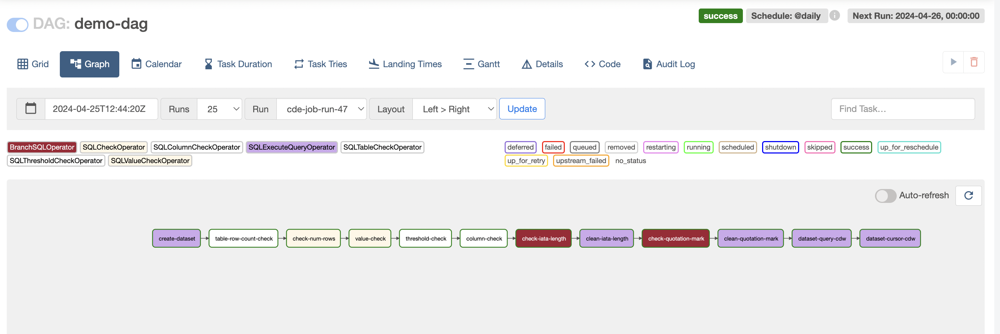
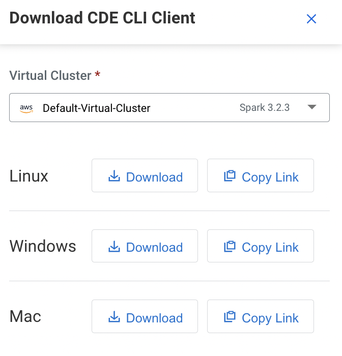
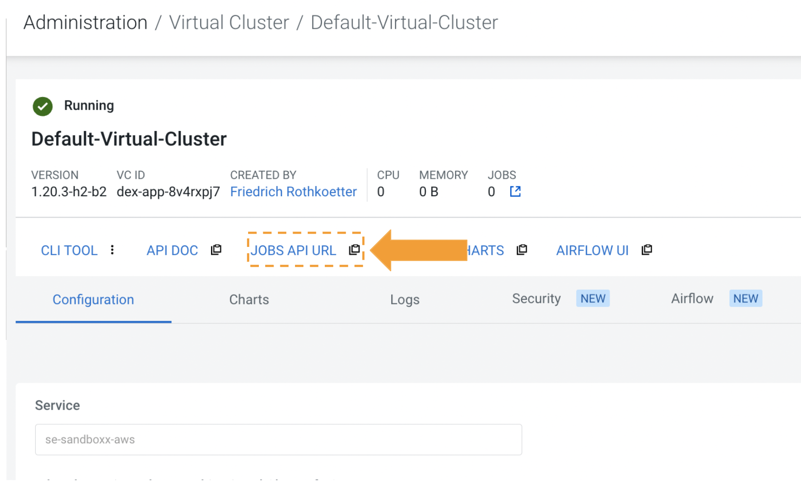
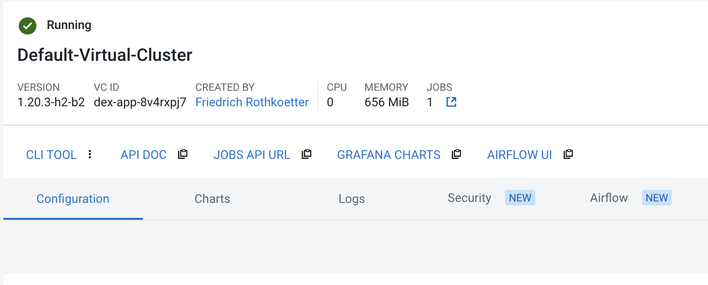
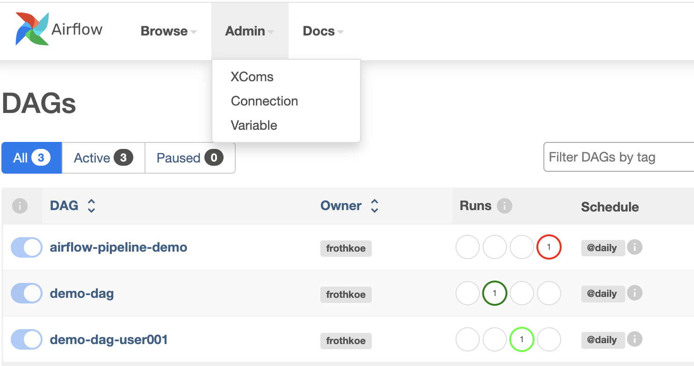
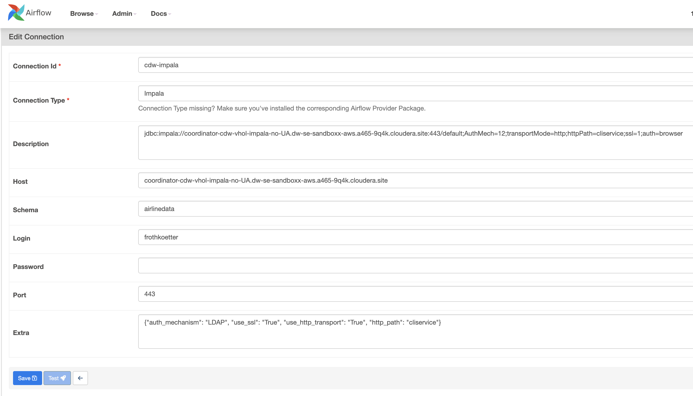

# SQL Operator in Apache Airflow with Cloudera Data Warehousing


In Cloudera Data Engineering (CDE), the integration of Apache Airflow brings powerful workflow orchestration capabilities to the platform, allowing users to seamlessly manage and schedule data pipelines.

## Introduction

Recently, Cloudera has introduced new support for Airflow's SQL operators, enhancing the capabilities of SQL tasks within Cloudera Data Platform (CDP). This integration allows users to seamlessly with Cloudera Data Warehousing (CDW) service execute SQL commands and perform database operations using Airflow within the Cloudera ecosystem. CDE users can now leverage familiar SQL-based tasks directly within their Airflow workflows, enabling efficient database interactions and data processing.

This integration enhances the flexibility and efficiency of data workflows within Cloudera's ecosystem, empowering users to build robust and scalable data pipelines.



## Lab 0 - Clone the github, CDE cli install

In your home directory

```bash
git clone https://github.com/frothkoetter/CDW-CDE-Airflow-SQL-Operator.git
cd /path/to/CDW-CDE-Airflow-SQL-Operator
```

## Lab 1 - CDE CLI installation and configuration

Download software and move into the working directory



```bash
chmod +x /path/to/cde
```

Navigate to CDE, Virtual Cluster copy the Jobs API URL from the CDE Virtual Cluster page



i.e.

```sql
https://8v4rxpj7.cde-dvtxl9n8.se-sandb.a465-9q4k.cloudera.site/dex/api/v1
```

Edit the CDE cli config.yml file and add the Job API URL to the vcluster-endpoint
and the your login ID (user001..030)

```sql
% vi ~/.cde/config.yml

user: user001
vcluster-endpoint: https://8v4rxpj7.cde-dvtxl9n8.se-sandb.a465-9q4k.cloudera.site/dex/api/v1      
```

Save the file and return to the github


-----
## Lab 2 - Create Database

Navigate to Data Warehouse, then Virtual Warehouse and open the HUE SQL Authoring tool.

Create new database for your user to be used, or use one that is already created for you.

```sql
-- Change *** of database name
CREATE DATABASE DB_USER0**;

USE DB_USER0**;
```
Your can check your current database
```sql
select current_database();
```
-----
## Lab 3 - View CDW Connection configuration

Navigate to CDE on the cluster configuration and open Airflow,



navigate to connection



Review the connection details



## Lab 4 - Change the USER in CDE CLI scripts

open the shell script and change the 'USER=user001' to your user ID

```bash
# Create a resource
USER=user001

# Variables for Airflow
RESOURCE=demo-dag-$USER
JOB=demo-job-$USER

./cde resource delete --name $RESOURCE
./cde resource create --name $RESOURCE
./cde resource upload --name $RESOURCE --local-path demo-dag.py
./cde resource describe --name $RESOURCE


# Create Job of “airflow” type and reference the DAG
./cde job delete --name $JOB
./cde job create --name $JOB --type airflow --dag-file demo-dag.py  --mount-1-resource $RESOURCE

#Trigger Airflow job to run
./cde job run --name $JOB
```


## Lab 5 - Upload and start the Airflow DAG


```bash
/create-dag.sh
API User Password:
     6.6KB/6.6KB 100% [==============================================] demo-dag.py
{
  "name": "demo-dag-user001",
  "type": "files",
  "status": "ready",
  "signature": "a1f49a22feed4199ca2f0e5da9ee7e26864ef6ba",
  "created": "2024-04-26T12:27:57Z",
  "modified": "2024-04-26T12:27:58Z",
  "retentionPolicy": "keep_indefinitely",
  "files": [
    {
      "path": "demo-dag.py",
      "signature": "1e379668c7480d24bdec2148256f6f66d833cdac",
      "sizeBytes": 6562,
      "created": "2024-04-26T12:27:58Z",
      "modified": "2024-04-26T12:27:58Z"
    }
  ]
}
Error: delete job failed: could not get job from storage: job not found
{
  "id": 49
}
```


## How to use SQL Operator in Apache Airflow

In Cloudera Data Engineering (CDE), the integration of Apache Airflow brings powerful workflow orchestration capabilities to the platform, allowing users to seamlessly manage and schedule data pipelines.
Cloudera's Support for SQL Operators

Recently, Cloudera has introduced new support for Airflow's SQL operators, enhancing the capabilities of SQL tasks within Cloudera Data Platform (CDP). This integration allows users to seamlessly with Cloudera Data Warehousing (CDW) service execute SQL commands and perform database operations using Airflow within the Cloudera ecosystem. CDE users can now leverage familiar SQL-based tasks directly within their Airflow workflows, enabling efficient database interactions and data processing.
This integration enhances the flexibility and efficiency of data workflows within Cloudera's ecosystem, empowering users to build robust and scalable data pipelines.
Optimizing Data Quality Checks in Cloudera Data Engineering (CDE) with Apache Airflow

In data engineering workflows, ensuring data quality is essential for generating accurate insights and making informed decisions. Cloudera Data Engineering (CDE) now offers robust integration with Apache Airflow, allowing users to implement advanced data quality checks using specialized SQL operators. Let's explore how to leverage these operators with practical examples to streamline data quality validation within CDE.
Introduction to SQL Operators in Apache Airflow

Apache Airflow provides a suite of SQL operators that enable seamless interaction with databases and efficient data validation.

Two key operators for data quality checks are `SQLColumnCheckOperator` and `SQLTableCheckOperator`. These operators empower users to perform column-level and table-level checks, ensuring data integrity and adherence to business rules.

### SQLColumnCheckOperator

The `SQLColumnCheckOperator` allows you to perform comprehensive checks on specific columns within a table.

In this example we want to perform two types of checks on the `iata` column:
Null Check** (`null_check`): Ensures that the number of null values (`iata IS NULL`) in the `iata` column is equal to 0.
Distinct Check** (`distinct_check`): Ensures that the number of distinct values (`COUNT(DISTINCT(iata))`) in the `iata` column is greater than or equal to 2.

This following Airflow Code example shows the configuration to validate the integrity of the `iata` column in the `airlinedata.airports_ice` table


```python
column_check = SQLColumnCheckOperator(
        task_id="column-check",
        dag = dag,
        conn_id=_CONN_ID,
        table=f'{_DB_NAME}.{_TABLE_NAME}',
        column_mapping={
            "iata": {
                "null_check": {"equal_to": 0},
                "unique_check": {"equal_to": 0},
                "distinct_check": {"geq_to": 2},
            },
        },
    )
```

Airflow Operator translates this configuration to following SQL Query. The SQL query generates a result set that represents the outcome of these column checks:


```SQL
SELECT col_name, check_type, check_result
FROM (
    -- Subquery for Null Check
    SELECT 'iata' AS col_name, 'null_check' AS check_type, iata_null_check AS check_result
    FROM (
        -- Subquery to calculate number of null values in 'iata' column
        SELECT SUM(CASE WHEN iata IS NULL THEN 1 ELSE 0 END) AS iata_null_check
        FROM airlinedata.airports_ice
    ) AS sq

    UNION ALL

    -- Subquery for Distinct Check
    SELECT 'iata' AS col_name, 'distinct_check' AS check_type, iata_distinct_check AS check_result
    FROM (
        -- Subquery to calculate number of distinct values in 'iata' column
        SELECT COUNT(DISTINCT(iata)) AS iata_distinct_check
        FROM airlinedata.airports_ice
    ) AS sq
) AS check_columns;
```

The result in the logfile  

INFO - Record: [('iata', 'null_check', 0), ('iata', 'distinct_check', 3376)]

If one check fails the pipeline stop the Airflow dag.

### SQLTableCheckOperator

The SQLTableCheckOperator configuration you provided defines a data quality check (row_count_check) for the .airports table. Let's break down how this corresponds to the SQL query generated by the operator configuration. The SQLTableCheckOperator is configured to perform a single check (row_count_check) on the airports table. This check verifies that the row count (COUNT(*)) of the table is greater than or equal to 10,000 rows.

The SQL query you provided generates a result set that represents the outcome of the specified table check (row_count_check). Let's demonstrate how to perform a row count check on the `airlinedata.airports_ice` table:

```Python
table_checks = SQLTableCheckOperator(
    task_id="table_checks",
    dag=dag,
    conn_id="cdw-impala",
    table="airlinedata.airports_ice",
    checks={
        "row_count_check": {"check_statement": "COUNT(*) >= 10000"},
    },
)
```

In this example, the `SQLTableCheckOperator` verifies that the row count in the `airlinedata.airports_ice` table is greater than or equal to 10,000 rows. The output is as following

The following tests have failed:
	Check: row_count_check,
	Check Values: {'check_statement': 'COUNT(*) >= 10000', 'success': False}
; 30)
{local_task_job_runner.py:225} INFO - Task exited with return code 1

The table contains only 3500 rows and the task is flagged as failure and subsequent tasks are not performed.
Branching in Apache Airflow SQL Operator

### BranchSQLOperator

When designing workflows with Apache Airflow like flow control they utilize the SQL operator `BranchSQLOperator`. It is essential to follow best practices for effective branching and data quality checks.
Use`BranchSQLOperator` to execute SQL queries that perform data quality checks. For example, checking for unexpected quotation marks (`"`) in fields, which can indicate data quality issues like unescaped characters.

```Python
sql_check_quotation_mark = """
select
      count(*) as failures
    from (
with validation as (
        select {{ params.column }} as field
        from {{ params.db }}.{{ params.table }}
),
validation_errors as (
        select field from validation
        where field rlike('\"')
)
select *
from validation_errors
) quotation_marks_test;
"""

check_quotation_mark = BranchSQLOperator(
    task_id="check-quotation-mark",
    conn_id=_CONN_ID,
    follow_task_ids_if_false=['check-num-rows'],
    follow_task_ids_if_true=['clean-quotation-mark'],
    sql=sql_check_quotation_mark,
    params={'db': _DB_NAME, 'table': _TABLE_NAME, 'column':'airport'},
    dag=dag,
)
```

Executing Remediation SQL

Based on the results of data quality checks, use `BranchSQLOperator` to decide the workflow path. For example, if the quotation marks check fails, execute a remediation SQL query to replace the problematic characters.

```Python    
sql_clean_quotation_mark = """
update {{ params.db }}.{{ params.table }}
set {{ params.column }}  = regexp_replace( {{ params.column }} ,'"','')
where  {{ params.column }} rlike('"');
"""
clean_quotation_mark = SQLExecuteQueryOperator(
    task_id="clean-quotation-mark",
    conn_id=_CONN_ID,
    sql=sql_clean_quotation_mark,
    params={'db': _DB_NAME, 'table': _TABLE_NAME, 'column':'airport'},
    dag=dag,
)
```


### SQLCheckOperator to verify dataset integrity

Alternative to above mentioned table and columns operators you can us generic SQLCheckOperator such as checking the number of rows in a table.

```Python
sql_check_num_rows = """
select count(1) as num_rows from {{ params.db }}.{{ params.table }};
"""

check_num_rows = SQLCheckOperator(
    task_id="check-num-rows",
    conn_id=_CONN_ID,
    sql=sql_check_num_rows,
    params={'db': _DB_NAME, 'table': _TABLE_NAME},
    trigger_rule="none_failed",
    dag=dag,
)
```
### Setting Trigger Rules

Configure the `trigger_rule` parameter to control task execution based on the status of upstream tasks. For example, using `"none_failed"` ensures that the dataset size check (`dw_check_num_rows`) runs only if no previous tasks have failed.

By following these best practices, you can design robust workflows in Apache Airflow that leverage SQL operators for data quality checks, remediation actions, and workflow branching based on conditional logic. Ensure that your SQL queries are efficient and designed to handle potential data issues to maintain data integrity within your pipelines. Adjust the parameters and SQL queries according to your specific use case and database configuration.

## SQLThresholdCheckOperator ensuring Data Quality

In Apache Airflow, the `SQLThresholdCheckOperator` is a powerful tool for validating data integrity and quality through SQL queries. Let's explore how this operator can be used to perform threshold checks on your data.
The `SQLThresholdCheckOperator` allows you to execute SQL queries against your database and check whether the returned result falls within specified threshold values. This operator is useful for monitoring and enforcing data quality standards within your workflows.
Example Usage:
Consider a scenario where we want to verify that the count of records in a database table (falls within a specific range of 3000 to 4000 records. We can achieve this using the `SQLThresholdCheckOperator` as follows:

```Phyton
sql_value_check = """
 SELECT COUNT(*) AS record_count FROM airflow_sql.airports;
"""
# Define the SQLThresholdCheckOperator task
threshold_check = SQLThresholdCheckOperator(
    task_id="threshold-check",
    conn_id="cdw-impala",
    sql=sql_value_check,
    min_threshold=3000,
    max_threshold=4000,
    dag=dag
)
```

Output Example:
[2024-04-24, 16:37:14 UTC] INFO - Test threshold-check Successful.

### Explanation:

The `SQLThresholdCheckOperator` (`threshold_check`) is configured to execute a SQL query (`sql_value_check`) against a specified CDW database connection. The SQL query retrieves the count of records (`record_count`) from the table. The operator checks if the `record_count` falls within the specified range (`min_threshold=3000`, `max_threshold=4000`).

If the count is within the threshold range, the operator logs a successful test result, if not the task is set to fail.

By leveraging the `SQLThresholdCheckOperator` in Apache Airflow, you can implement robust data quality checks to validate your data against specified thresholds. This helps maintain data integrity and reliability within your workflows, ensuring that your data-driven decisions are based on accurate and trustworthy information. Customize the operator parameters and SQL queries to suit your specific use case and data quality requirements.

## Data Extraction in Airflow with SQL Operators

In Apache Airflow, data extraction from databases is made straightforward with the SQLExecuteQueryOperator and custom fetch handler functions. This combination allows users to seamlessly retrieve and process query results within Airflow workflows. Let's explore how this is achieved using a practical example.

First, define a custom fetch handler function (`process_query_results`) to process query results fetched by the SQLExecuteQueryOperator. This function iterates over each row of the fetched results and performs specific actions, such as logging row data.

```Python
def process_query_results(cursor, **kwargs):
    results = cursor.fetchall()  # Fetch all rows from the cursor
    for row in results:
        # Process each row (e.g., log row data)
        print(f"Row Data: {row}")
```

Next, integrate the `SQLExecuteQueryOperator` into your Airflow DAG to execute SQL queries and retrieve data from the database. Configure the operator to use the defined fetch handler (`process_query_results`) for processing the query results.

```Python
sql_query_sample = """
select * from {{ params.db }}.{{ params.table }} limit 10;
"""

cursor_sample = SQLExecuteQueryOperator(
    task_id="dataset-cursor-cdw",
    conn_id=_CONN_ID,
    sql=sql_query_sample,
    params={'db': _DB_NAME, 'table': _TABLE_NAME },
    dag=dag,
    show_return_value_in_logs=True,
    handler=process_query_results
)
```

### Example Result Set

Upon executing the DAG task, the SQL query will retrieve the first 10 rows from the default.airports table. The fetched rows will be processed by the custom fetch handler function (process_query_results), and the extracted data will be logged or further processed based on your requirements.
select * from default.airports limit 10;, parameters: None

```
INFO - Row Data: ('00M', '"Thigpen "', 'Bay Springs', '', 'USA', 31.95376472, -89.23450472)
INFO - Row Data: ('00R', 'Livingston Municipal', 'Livingston', '', 'USA', 30.68586111, -95.01792778)
INFO - Row Data: ('00V', 'Meadow Lake', 'Colorado Springs', '', 'USA', 38.94574889, -104.5698933)
INFO - Row Data: ('01G', 'Perry-Warsaw', 'Perry', '', 'USA', 42.74134667, -78.05208056)
INFO - Row Data: ('01J', 'Hilliard Airpark', 'Hilliard', '', 'USA', 30.6880125, -81.90594389)
INFO - Row Data: ('01M', 'Tishomingo County', 'Belmont', '', 'USA', 34.49166667, -88.20111111)
INFO - Row Data: ('02A', '"Gragg-Wade "', 'Clanton', '', 'USA', 32.85048667, -86.61145333)
INFO - Row Data: ('02C', 'Capitol', 'Brookfield', '', 'USA', 43.08751, -88.17786917)
INFO - Row Data: ('02G', 'Columbiana County', 'East Liverpool', '', 'USA', 40.67331278, -80.64140639)
INFO - Row Data: ('03D', 'Memphis Memorial', 'Memphis', '', 'USA', 40.44725889, -92.22696056)
```

## Enhancing Data Extraction Capabilities

By leveraging the `SQLExecuteQueryOperator` with a custom fetch handler function, Airflow users can efficiently extract and process data from databases within their workflows. This approach facilitates seamless integration of SQL queries and result processing, enabling enhanced data extraction capabilities and improved workflow automation.

Cursor-based fetching offers flexibility for complex data processing within Python scripts but requires manual management of database connections and cursor operations.

If you just want to print a few rows into the logs you can set the parameter:  show_return_value_in_logs=True in the SQLExcuteQueryOperator:

```Python
sql_query_sample = """
select * from airflow_sql.airports limit 10;
"""
query_sample = SQLExecuteQueryOperator(
    task_id="dataset-query-cdw",
    conn_id=_CONN_ID,
    sql=sql_query_sample,
    dag=dag,
    show_return_value_in_logs=True
)
```

This example contains a SQL query string to retrieve the first 10 rows (LIMIT 10) from the airflow_sql.airports table. You should always limit the output to logfiles not not overload the logging and extend size of the log files. Use with caution. It’s not recommended to dump large datasets to the log.

## Conclusion
By harnessing the power of Apache Airflow's SQL operators within Cloudera Data Engineering (CDE) leveraging the powerful SQL engines in Cloudera Data Warehouse (CDW), users can implement robust data quality checks and validation processes seamlessly.

Customize SQL queries, leverage conditional logic, and integrate data quality checks seamlessly into your workflows to maintain data integrity and enhance decision-making processes.
Apache Airflow's SQL operators provide a robust foundation for building scalable and reliable data pipelines within Cloudera's ecosystem. Embrace these tools to harness the power of SQL for data validation, extraction, and workflow orchestration, enabling data-driven insights and operational excellence.

## Limitation

Currently support only CDW Impala virtual warehouses (configured without Unified Analytics).
